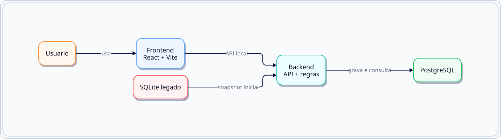

# NSJB Forms

Sistema do NSJB para formularios de presenca, escala e acompanhamento operacional da Organ.

## O que o projeto entrega

- Cadastro, edicao e arquivamento de formularios.
- Formulario publico de presenca com resposta persistida.
- Formulario publico de escala com reserva de vagas por nome.
- Painel de resultados para acompanhamento operacional.
- Area administrativa para usuarios, socios, classificacoes, presets e catalogos.
- Execucao oficial via Docker Compose com PostgreSQL.

## Mapa visual



## Como funciona

1. o usuario abre o frontend
2. o frontend chama o backend
3. o backend valida, aplica as regras e grava no PostgreSQL

Leituras principais:

- [docs/FUNCIONALIDADES.md](docs/FUNCIONALIDADES.md) - o que a aplicacao entrega e como cada fluxo funciona.
- [docs/DIAGRAMAS.md](docs/DIAGRAMAS.md) - mapas visuais gerados em SVG a partir de D2.
- [docker/README.md](docker/README.md) - como subir e operar a stack oficial.

## Organizacao do projeto

- `frontend/` - interface React + Vite.
- `backend/` - API Node, regras de negocio e persistencia.
- `shared/` - regras compartilhadas entre frontend e backend.
- `docker/` - stack oficial de execucao e documentacao de infraestrutura.
- `docs/` - documentacao funcional, tecnica e de manutencao.
- `scripts/windows/` - atalhos locais para Windows.

## Subir em outra maquina

O caminho oficial e via Docker Compose.

### Requisitos

- Docker Desktop instalado e funcionando.
- Git para clonar o repositorio.

### Passo a passo

```powershell
docker compose -f docker/compose.yml up -d --build
```

Depois abra:

- Frontend: `http://localhost:5173`
- Backend health: `http://localhost:8787/api/health`

### Para parar

```powershell
docker compose -f docker/compose.yml down
```

### Para ver o estado da stack

```powershell
docker compose -f docker/compose.yml ps
```

### Para ver logs

```powershell
docker compose -f docker/compose.yml logs -f
```

## Documentacao central

- [docs/FUNCIONALIDADES.md](docs/FUNCIONALIDADES.md) - guia funcional completo.
- [docs/DIAGRAMAS.md](docs/DIAGRAMAS.md) - mapas visuais e fontes declarativas.

## Regra de manutencao

Esta documentacao e viva. Quando o projeto avancar, ajuste os textos, diagramas e READMEs da area alterada no mesmo ciclo da mudanca.

## Desenvolvimento e testes

- `npm run dev` - sobe a stack oficial via Docker Compose.
- `npm run dev:local` - executa o fluxo local de desenvolvimento.
- `npm run docker:build` - recompila as imagens.
- `npm run docker:up` - sobe os containers.
- `npm run docker:down` - derruba a stack.
- `npm run docker:restart` - reinicia a stack.
- `npm run docker:logs` - mostra logs.
- `npm run docker:ps` - mostra o estado atual.
- `npm run build` - build do frontend.
- `npm run test` - suite completa.
- `npm run test:api` - testes de API.
- `npm run test:ui` - testes de UI.
- `npm run test:forms` - subsete de testes de formularios.

## Documentacao tecnica

- [frontend/README.md](frontend/README.md) - estrutura da interface.
- [backend/README.md](backend/README.md) - estrutura da API e banco.
- [docker/README.md](docker/README.md) - operacao da stack oficial.
- [docs/DIAGRAMAS.md](docs/DIAGRAMAS.md) - diagramas declarativos e imagens geradas.
- [docs/MAPA-CODIGO.md](docs/MAPA-CODIGO.md) - mapa rapido do codigo.
- [docs/ARQUITETURA.md](docs/ARQUITETURA.md) - arquitetura por camadas.
- [docs/PADROES-CODIGO.md](docs/PADROES-CODIGO.md) - padroes de implementacao.
- [docs/GUIA-TECNICO.md](docs/GUIA-TECNICO.md) - decisoes e operacao.
- [docs/MANUTENCAO.md](docs/MANUTENCAO.md) - regras de manutencao.
- [docs/briefing-original.md](docs/briefing-original.md) - briefing inicial.
- [docs/IA-LOG.md](docs/IA-LOG.md) - historico curto das alteracoes assistidas.

## Contas de teste

- `admin` / `admin123`
- `viewer` / `viewer123`

## Dados e persistencia

- O backend persiste os dados no PostgreSQL do Docker.
- A stack local continua disponivel como compatibilidade, mas nao e o caminho oficial.
- A configuracao dos socios continua vindo de Google Sheets para manter a operacao simples.
