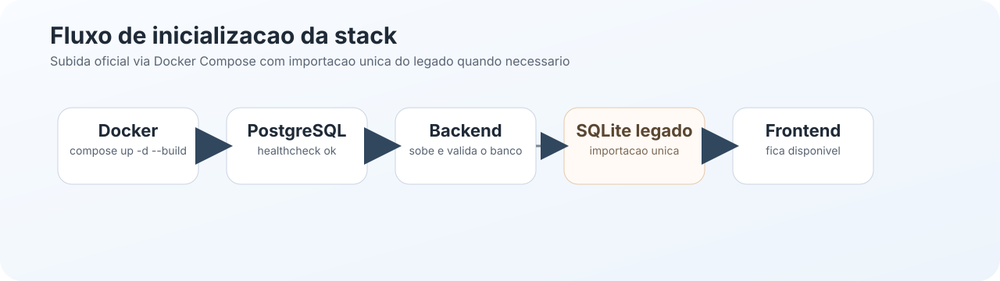

# Docker

Documentacao da stack oficial do NSJB Forms.

## O que existe aqui

- `docker/compose.yml` - orquestracao da stack.
- `docker/frontend/` - imagem e README do frontend.
- `docker/backend/` - imagem e README do backend.
- `docker/db/` - esquema, plano e desenho do banco.
- `docker/postgres/` - README do servico PostgreSQL.

## Como a stack funciona

O `docker/compose.yml` sobe os tres blocos oficiais do projeto:

1. `postgres` recebe e persiste os dados
2. `backend` conecta no banco, expõe a API e aplica regras
3. `frontend` entrega a interface React para o usuario

O fluxo esperado e subir tudo de uma vez. O compose resolve a ordem e aguarda o banco ficar pronto antes do backend depender dele.

## Mapa visual



## Leitura rapida

- `docker/compose.yml` define a stack completa.
- `docker/backend/README.md` explica o container da API.
- `docker/frontend/README.md` explica o container da interface.
- `docker/db/README.md` resume o banco e a migracao.
- `docker/postgres/README.md` documenta o servico PostgreSQL.

## Como subir em qualquer maquina

Use a partir da raiz do repositorio:

```powershell
docker compose -f docker/compose.yml up -d --build
```

Isso sobe:

- `frontend` em `http://localhost:5173`
- `backend` em `http://localhost:8787`
- `postgres` em `localhost:5432`

## Como parar

```powershell
docker compose -f docker/compose.yml down
```

## Ajustes comuns

- Porta do frontend: `NSJB_FRONTEND_PORT`
- Porta da API: `NSJB_API_PORT`
- Porta do PostgreSQL: `NSJB_PGPORT`
- Nome do banco: `NSJB_PGDATABASE`
- Usuario do banco: `NSJB_PGUSER`
- Senha do banco: `NSJB_PGPASSWORD`

Se voce mexer em infraestrutura, comece por este arquivo e depois leia `docker/backend/README.md` e `docker/db/README.md`.

## Documentacao por componente

- [docker/frontend/README.md](frontend/README.md)
- [docker/backend/README.md](backend/README.md)
- [docker/db/README.md](db/README.md)
- [docker/postgres/README.md](postgres/README.md)
- [docker/PLANO-MIGRACAO-DOCKER.md](PLANO-MIGRACAO-DOCKER.md)
- [docker/HANDOFF-INFRA-BANCO.md](HANDOFF-INFRA-BANCO.md)
- [docs/DIAGRAMAS.md](../docs/DIAGRAMAS.md)

## Manutencao da documentacao

Este README e os READMEs filhos devem acompanhar qualquer mudanca na stack. Se a infraestrutura mudar, atualize o texto e o diagrama no mesmo ciclo.
