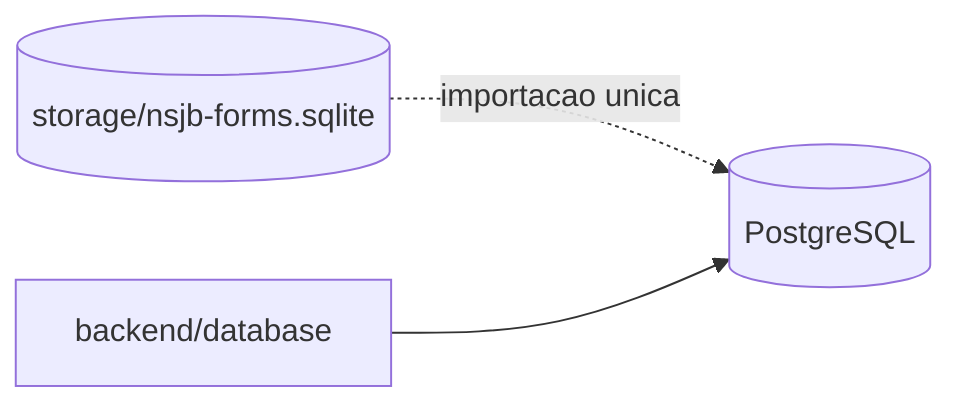

# Database Docker

Esta pasta documenta a camada de banco do NSJB Forms.

## Leitura rapida

- o banco oficial e PostgreSQL no compose
- o SQLite existe apenas como compatibilidade temporaria durante a transicao
- a importacao do legado acontece uma unica vez na primeira subida, quando o snapshot existe

## Estado atual

- o backend Docker persiste os dados no PostgreSQL do compose
- o SQLite ficou apenas como compatibilidade interna temporaria no codigo
- na primeira subida, o backend importa automaticamente o snapshot legado de `storage/nsjb-forms.sqlite` quando ele existe no build context

## Fluxo de banco

## Onde olhar no codigo

- `backend/database/` - facade e drivers de banco
- `backend/database/drivers/` - driver SQLite legado e driver Postgres oficial
- `backend/seed.mjs` - seed inicial da aplicacao
- `backend/data/seedData.mjs` - dados seed usados pelo backend

## Documentos da migracao

- `docker/db/DESENHO-CAMADA-BANCO.md` - desenho da camada de acesso ao banco
- `docker/db/PLANO-MIGRACAO-POSTGRESQL.md` - fases e riscos da migracao para PostgreSQL
- `docker/db/ESQUEMA-BANCO-DADOS.md` - esquema funcional atual e mapeamento futuro
- `docker/db/DDL-POSTGRESQL-INICIAL.sql` - DDL inicial para o alvo PostgreSQL
- `docker/postgres/README.md` - documentacao do service PostgreSQL no compose

## Ordem recomendada

1. manter o service PostgreSQL como padrao do compose
2. validar paridade de dados e comportamento
3. remover sobras de compatibilidade SQLite quando nao houver mais dependencia

## Regra pratica

- SQLite nao faz mais parte do fluxo oficial do ambiente
- a camada de importacao legado existe so para a transicao e deve sair quando o backlog de limpeza fechar
- use `npm run verify:legacy-parity` para comparar o snapshot SQLite legado com o PostgreSQL antes de remover o legado por completo
- se rodar fora do compose, passe `NSJB_VERIFY_PGHOST=127.0.0.1` e, se necessario, `NSJB_VERIFY_PGPORT`
- rode a comparacao depois de congelar as escritas, porque uma base viva pode divergir do snapshot legado por uso normal

## Manutencao

Atualize este documento sempre que o alvo de banco, a importacao legado ou a ordem de subida do compose mudar. O conteudo desta pasta deve acompanhar a evolucao da migracao.
