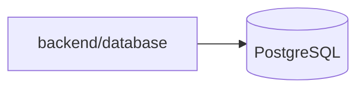

# Database Docker

Esta pasta documenta a camada de banco do NSJB Forms.

## Leitura rapida

- o banco oficial e PostgreSQL no compose

## Estado atual

- o backend Docker persiste os dados no PostgreSQL do compose

## Fluxo de banco

## Onde olhar no codigo

- `backend/database/` - facade e drivers de banco
- `backend/database/drivers/` - driver Postgres oficial
- `backend/seed.mjs` - seed inicial da aplicacao
- `backend/data/seedData.mjs` - dados seed usados pelo backend

## Documentos da migracao

- `docker/db/DESENHO-CAMADA-BANCO.md` - desenho da camada de acesso ao banco
- `docker/db/PLANO-MIGRACAO-POSTGRESQL.md` - fases e riscos da migracao para PostgreSQL
- `docker/db/ESQUEMA-BANCO-DADOS.md` - esquema funcional atual e mapeamento futuro
- `docker/db/DDL-POSTGRESQL-INICIAL.sql` - DDL inicial para o alvo PostgreSQL
- `docker/postgres/README.md` - documentacao do service PostgreSQL no compose

## Ordem recomendada

1. manter o service PostgreSQL como padrao do compose
2. manter a documentacao alinhada com a evolucao da infraestrutura

## Regra pratica

- se rodar fora do compose, ajuste `NSJB_PGHOST` e `NSJB_PGPORT` conforme o alvo de banco

## Manutencao

Atualize este documento sempre que o alvo de banco, a importacao legado ou a ordem de subida do compose mudar. O conteudo desta pasta deve acompanhar a evolucao da migracao.
