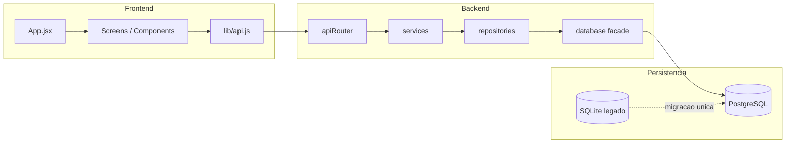
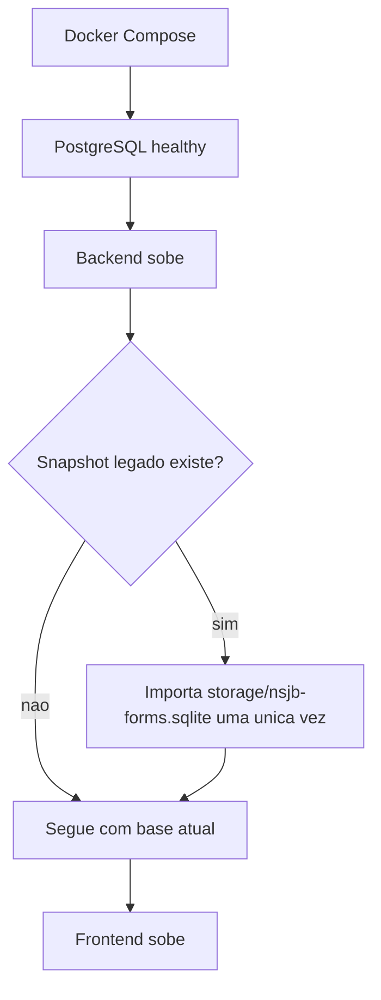
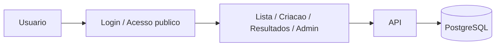

# Diagramas

Diagramas declarativos para ler a arquitetura e os fluxos sem precisar abrir o codigo.

## Arquitetura geral

```mermaid
flowchart LR
  subgraph UI[Frontend]
    A[App.jsx]
    B[Screens / Components]
    C[lib/api.js]
    A --> B --> C
  end

  subgraph API[Backend]
    D[apiRouter]
    E[services]
    F[repositories]
    G[database facade]
    D --> E --> F --> G
  end

  subgraph DB[Persistencia]
    H[(PostgreSQL)]
    I[(SQLite legado)]
  end

  C --> D
  G --> H
  I -. migracao unica .-> H
```

## Fluxo de inicializacao

```mermaid
flowchart TD
  A[Docker Compose] --> B[PostgreSQL healthy]
  B --> C[Backend sobe]
  C --> D{Snapshot legado existe?}
  D -- sim --> E[Importa storage/nsjb-forms.sqlite uma unica vez]
  D -- nao --> F[Segue com base atual]
  E --> F
  F --> G[Frontend sobe]
```

## Fluxo funcional resumido

```mermaid
flowchart LR
  U[Usuario] --> L[Login / Acesso publico]
  L --> F1[Lista / Criacao / Resultados / Admin]
  F1 --> API1[API]
  API1 --> DB1[(PostgreSQL)]
```
