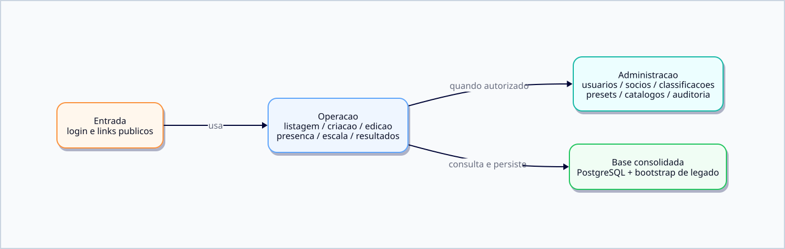

# Funcionalidades

Documento funcional do NSJB Forms.

## Mapa visual

## Como ler

- comece por esta pagina se voce quer entender o que a aplicacao faz
- use [docs/DIAGRAMAS.md](DIAGRAMAS.md) para abrir os mapas visuais
- use [README.md](../README.md) para a entrada mais curta do projeto

## Visao geral

O NSJB Forms centraliza a operacao de:

- formularios de presenca
- formularios de escala
- resultados e acompanhamento
- administracao da base e configuracoes

A aplicacao foi desenhada para rodar oficialmente em Docker com PostgreSQL.
O fluxo oficial assume uma maquina ou ambiente unico com os tres containers da stack.

## Perfis de uso

- `visitante` - acessa somente links publicos de formularios abertos.
- `viewer` - visualiza resultados e area interna de leitura.
- `admin` - cria, edita e administra formularios, usuarios, socios e catalogos.

## Funcionalidades por area

### 1. Listagem de formularios

- exibe titulo, tipo, status, classificacoes, fechamento e resumo de preenchimento
- permite buscar, ordenar, filtrar e fixar formularios para perfis de edicao
- permite abrir link publico
- permite acessar resultados, quando o perfil autoriza
- permite arquivar ou restaurar formularios
- permite excluir formulario com chave mestra

Como essa area funciona:

1. o frontend pede a lista inicial ao backend
2. o backend monta os metadados a partir do banco
3. a tela aplica filtros locais de busca e ordenacao
4. as acoes de arquivar, restaurar e excluir voltam para a API

### 2. Criacao e edicao de formularios

- cria formularios de presenca
- cria formularios de escala
- aplica presets como base inicial
- edita titulo, sessao, descricao, datas e status
- configura classificacoes
- define campos de presenca
- define secoes e vagas de escala
- salva rascunho, aberto, fechado ou arquivado

Como essa area funciona:

1. o usuario escolhe o tipo de formulario
2. a tela monta o modelo inicial com base em presets ou formulario existente
3. o frontend valida a estrutura basica antes de enviar
4. o backend valida de novo e grava a versao final

### 3. Formulario publico de presenca

- coleta respostas por link publico
- usa a base de socios para selecionar nomes
- salva resposta nova ou atualiza resposta existente
- respeita regras de validacao do formulario
- bloqueia duplicidade quando configurado
- permite consulta do formulario aberto ou fechado

Como essa area funciona:

1. o link publico identifica o formulario pelo slug
2. o frontend carrega a configuracao permitida para aquele formulario
3. o usuario escolhe um socio e preenche os campos
4. o backend salva a resposta e reaproveita a existente quando o fluxo permite edicao

### 4. Formulario publico de escala

- exibe secoes e vagas da escala
- permite preencher vaga por nome
- respeita limite de participacao por nome
- detecta conflito quando a vaga ja foi ocupada
- recarrega o estado ao encontrar conflito
- salva a estrutura atualizada da escala

Como essa area funciona:

1. a tela publica consulta a estrutura da escala
2. cada secao mostra vagas livres e ocupadas
3. ao escolher um nome, o backend verifica limites e conflitos
4. se houver disputa, o frontend recarrega o estado atual e tenta novamente

### 5. Resultados

- exibe respostas por formulario
- exibe escala preenchida e pendente
- mostra totais e resumo operacional
- permite exportacao em CSV, quando habilitada pela tela
- permite edicao de configuracao da escala por admin

Como essa area funciona:

1. o backend entrega a lista consolidada de respostas ou escala
2. o frontend monta a tabela e os totais
3. o admin pode entrar em ajustes quando a tela oferece edicao
4. a exportacao CSV gera uma visao externa da mesma base

### 6. Administracao

- gerencia usuarios
- gerencia socios
- gerencia classificacoes
- gerencia presets
- gerencia catalogo de campos base
- gerencia catalogo de tarefas base de escala
- configura a chave mestra de exclusao de formularios
- consulta logs de auditoria

Como essa area funciona:

1. o menu administrativo centraliza configuracoes de dominio
2. os cadastros sao persistidos no backend
3. as alteracoes entram no mesmo banco oficial da stack
4. a auditoria registra operacoes relevantes para consulta posterior

### 7. Bootstrap e inicio

- carrega dados iniciais ao abrir a aplicacao
- restaura sessao salva localmente
- resolve o formulario publico via slug
- carrega respostas e escala conforme a tela ativa

Como essa area funciona:

1. o backend sobe e carrega configuracoes e seed se necessario
2. o frontend restaura sessao e estado local
3. o usuario cai na ultima tela ativa ou no fluxo publico correto
4. o sistema usa isso para evitar telas vazias ou estados inconsistentes

### 8. Persistencia

- o banco oficial e PostgreSQL no Docker
- o backend continua com uma camada de acesso separada por repository

Como essa area funciona:

1. a aplicacao grava no PostgreSQL do Docker
2. a camada de repository isola consultas e comandos SQL
3. o fluxo oficial nao depende de arquivo local legado

## Fluxo funcional resumido

1. usuario entra na aplicacao
2. frontend carrega bootstrap inicial
3. usuario acessa lista, dashboard ou link publico
4. telas consultam a API
5. backend valida, aplica regras e persiste
6. frontend atualiza a visao e os resumos

## Resumo operacional

Se voce so precisa de uma visao rapida, pense assim:

- o frontend organiza a experiencia do usuario
- o backend valida e grava os dados
- o PostgreSQL concentra a persistencia oficial

## Relacao com a arquitetura

- Interface e tela ficam em `frontend/src/`
- Regras de negocio ficam em `backend/services/`
- Persistencia fica em `backend/repositories/`
- Rotas HTTP ficam em `backend/routes/`
- Infraestrutura oficial fica em `docker/`

## Documentos relacionados

- [README.md](../README.md)
- [docs/ARQUITETURA.md](ARQUITETURA.md)
- [docs/DIAGRAMAS.md](DIAGRAMAS.md)

## Regra de evolucao

Quando uma funcionalidade mudar de comportamento, ajuste esta pagina no mesmo ciclo para manter a leitura do produto atualizada.
